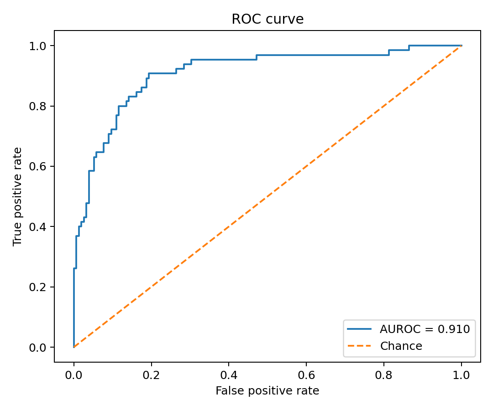
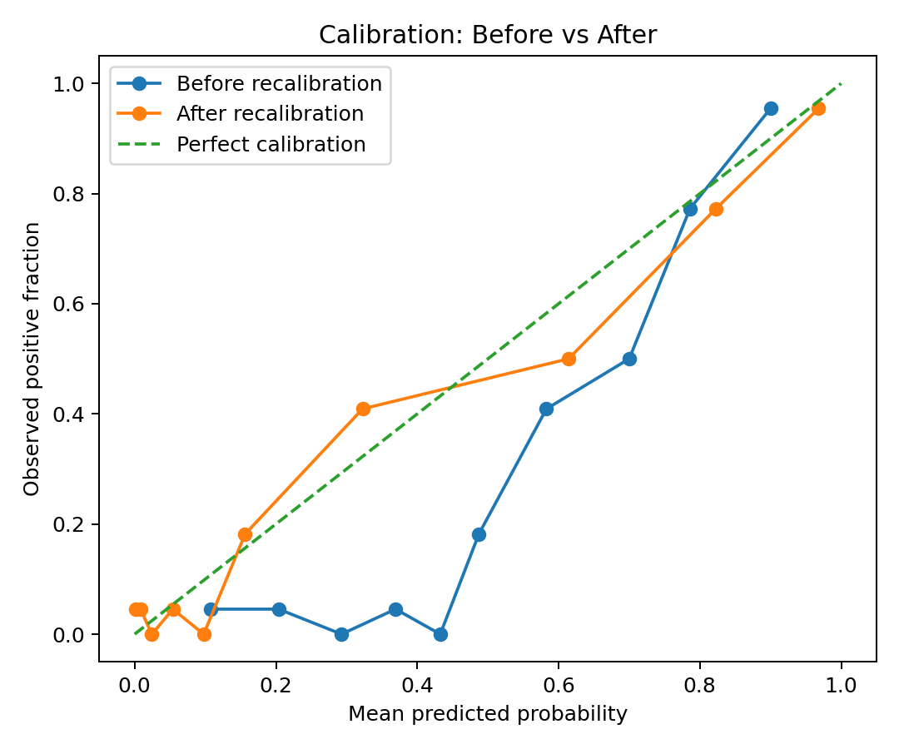
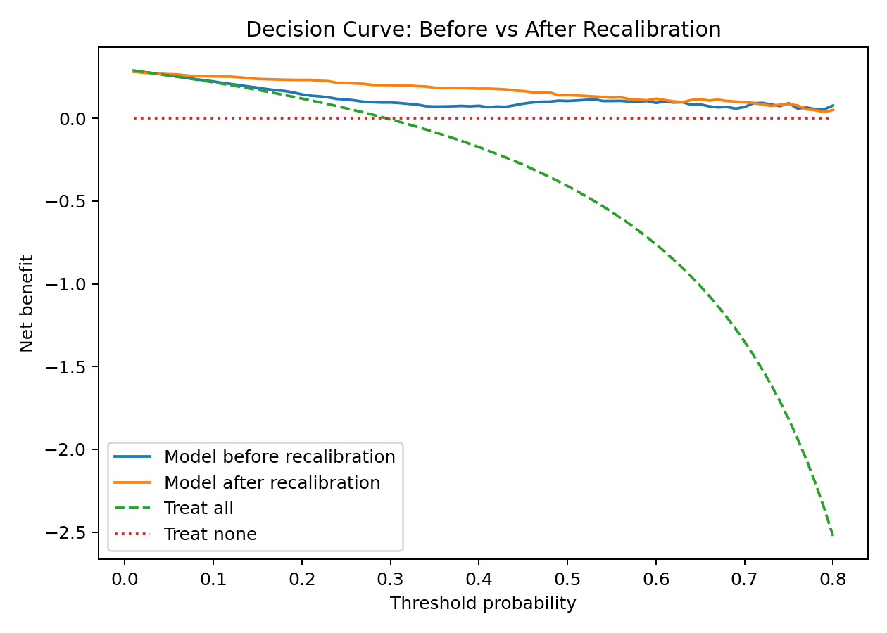

# Clinical AI Validation

A compact, reproducible binary clinical-AI validation workflow that goes beyond accuracy to evaluate **discrimination, uncertainty, calibration, external generalization, recalibration, and decision-curve net benefit**.

> **Important:** the bundled internal and external prediction CSVs are synthetic educational examples. The reported numbers below demonstrate the workflow and are not clinical claims.

## Why this project

A clinically credible AI evaluation should answer more than “does the model classify well?” This repository evaluates:

- **Discrimination:** AUROC and AUPRC
- **Threshold performance:** sensitivity, specificity, PPV, NPV, F1
- **Uncertainty:** nonparametric bootstrap 95% confidence intervals
- **Probability quality:** Brier score
- **Calibration:** reliability curve, calibration intercept and slope
- **Generalization:** internal vs external cohort performance
- **Recalibration:** logistic intercept/slope mapping fitted on the calibration cohort and frozen before external application
- **Clinical decision utility:** Decision Curve Analysis (DCA), threshold tables, and paired nested-bootstrap 95% CIs for change in net benefit

## Data contract

Input CSVs require three columns:

```csv
patient_id,y_true,y_prob
P001,1,0.91
P002,0,0.12
P003,1,0.73
```

`y_prob` must be a probability in `[0, 1]`. For clustered data such as multiple images per patient, bootstrap resampling should be performed at the patient/cluster level rather than independently per image.

## Project structure

```text
clinical-ai-validation/
├── data/
│   ├── example_internal_predictions.csv
│   └── example_external_predictions.csv
├── src/
│   ├── metrics.py
│   ├── bootstrap.py
│   ├── calibration.py
│   ├── recalibration.py
│   ├── plots.py
│   ├── dca.py
│   └── dca_bootstrap.py
├── tests/
├── outputs/
├── validate.py
├── recalibrate.py
├── dca_threshold_table.py
├── requirements.txt
├── pytest.ini
└── README.md
```

## Quick start

```bash
pip install -r requirements.txt
pytest -q
```

The packaged project currently passes **5 tests**.

### 1. Internal validation

```bash
python validate.py \
  --predictions data/example_internal_predictions.csv \
  --cohort-name internal \
  --threshold 0.5 \
  --bootstrap 1000
```

### 2. External validation

```bash
python validate.py \
  --predictions data/example_external_predictions.csv \
  --cohort-name external \
  --threshold 0.5 \
  --bootstrap 1000
```

### 3. Fit recalibration on internal and apply to external

```bash
python recalibrate.py \
  --calibration-predictions data/example_internal_predictions.csv \
  --target-predictions data/example_external_predictions.csv \
  --target-name external \
  --threshold 0.5
```

The recalibration parameters are fitted **only on the calibration/internal cohort** and then frozen before the external cohort is evaluated. Do not fit recalibration parameters on the external test cohort and then report performance on the same cohort.

### 4. DCA threshold table + nested-bootstrap CI

```bash
python dca_threshold_table.py \
  --calibration-predictions data/example_internal_predictions.csv \
  --target-predictions data/example_external_predictions.csv \
  --target-name external \
  --thresholds 0.10 0.20 0.30 0.40 0.50 0.60 \
  --bootstrap 1000 \
  --seed 42
```

Each bootstrap iteration resamples the calibration cohort, refits recalibration, resamples the external cohort, and computes paired before/after net benefit.

## Example results

| Metric | Internal | External |
|---|---:|---:|
| AUROC | 0.9496 | 0.9097 |
| AUPRC | 0.9269 | 0.8368 |
| Brier | 0.1266 | 0.1564 |
| Sensitivity @ 0.5 | 0.9524 | 0.9077 |
| Specificity @ 0.5 | 0.7795 | 0.7677 |
| PPV @ 0.5 | 0.6993 | 0.6211 |
| NPV @ 0.5 | 0.9682 | 0.9520 |
| Calibration intercept | -1.4881 | -1.4359 |
| Calibration slope | 2.2475 | 1.8620 |

External discrimination remains strong, but calibration is poor before recalibration.

## Recalibration result

| Metric | Before | After |
|---|---:|---:|
| AUROC | 0.9097 | 0.9097 |
| AUPRC | 0.8368 | 0.8368 |
| Brier | **0.1564** | **0.1040** |
| Calibration intercept | -1.4359 | -0.1832 |
| Calibration slope | 1.8620 | 0.8743 |

Because logistic recalibration is monotonic here, AUROC and AUPRC remain unchanged. The improvement is in **probability reliability**, not ranking.

## Key figures

### External ROC



### External calibration before vs after recalibration



### Decision curve before vs after recalibration



## DCA interpretation

The example data show positive paired changes in net benefit at thresholds 0.10-0.40 with bootstrap 95% CIs entirely above zero. The largest point-estimate gains occur near 0.30-0.40. At thresholds 0.50 and 0.60, the CI for change in net benefit crosses zero, so evidence for improvement is weaker.

DCA supports **potential clinical utility** under specified decision thresholds; it does not establish prospective clinical effectiveness. Threshold ranges should be clinically pre-specified rather than selected after inspecting the curve.

## Core concepts

- **AUROC:** ranking/discrimination across thresholds.
- **AUPRC:** positive-class retrieval; especially useful with class imbalance.
- **Brier score:** mean squared probability error; lower is better.
- **Calibration intercept:** ideal 0; systematic offset from 0 reflects overall risk misestimation.
- **Calibration slope:** ideal 1; `<1` implies predictions are too extreme, `>1` implies predictions are not extreme enough.
- **External validation:** evaluates transportability to a different cohort/domain.
- **DCA:** compares model net benefit with treat-all and treat-none strategies across clinically meaningful threshold probabilities.

## Important methodological rules

1. Do not tune a decision threshold on the final test/external cohort.
2. Fit recalibration on a development/calibration cohort, then freeze it before external evaluation.
3. Report confidence intervals, not only point estimates.
4. PPV and NPV depend strongly on disease prevalence.
5. High AUROC does not imply good calibration.
6. DCA does not prove clinical utility; it evaluates decision-theoretic net benefit under specified assumptions.

## Outputs

See `outputs/final_results.md` for the complete result tables and `outputs/final_results.csv` for a machine-readable summary.
